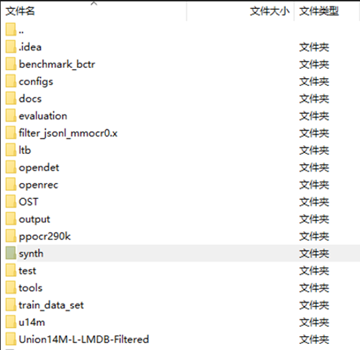

# HADOCR 
path = ../openrec/modeling/decoders/rctc_decoder.py

增加class FRMVBlock和class FRMHBlock

path = ../opendet/modeling/backbones/repvit.py

增加class SEModule(nn.Module) 

path = ../tools/data/ratio_sampler.py

DRS 根据文本图片的长宽比，通过动态比例采样调节，动态选择适合采样批次的输入尺寸，避免了在固定尺寸重采样时对文本图像的拉伸/压缩造成形变引起的失真

path = ../openrec/modeling/encoders/svtrv2.py

主要增强代码块

path = ../tools/visualize.py（新增）

根据result坐标和文本，将识别结果在图片上显示

# 数据集：

Synthetic datasets (MJ+ST)

Union14M-L-Filter

Common Benchmarks（evaluation）

LTB and OST

Chinese Benckmark

数据集来源
https://github.com/Topdu/OpenOCR/tree/main/configs/rec/svtrv2

注意：复现时numpy2.x.x可能会报错，如出错请降版本至1.24.x

# dataset_structure

dataset structure

benchmark_bctr 
├── benchmark_bctr_test 
│  　　├── document_test 
│   　　├── handwriting_test 
│   　　├── scene_test 
│   　　└── web_test 
└── benchmark_bctr_train 
　　    ├── document_train 
 　　   ├── handwriting_train 
  　　  ├── scene_train 
  　 　└── web_train 
evaluation 
├── CUTE80 
├── IC13_857 
├── IC15_1811 
├── IIIT5k 
├── SVT 
└── SVTP 
filter_jsonl_mmocr0.x 
ltb 
OST 
├── heavy 
└── weak 
synth 
├── MJ 
│　　├── test 
│　　├── train 
│　　└── val 
└── ST 
test 
├── ArT 
├── COCOv1.4 
├── CUTE80 
├── IC13_1015 
├── IC13_1095 
├── IC13_857 
├── IC15_1811 
├── IC15_2077 
├── IIIT5k 
├── SVT 
├── SVTP 
└── Uber 
train_data_set  # individual dataset 
u14m 
├── artistic 
├── contextless 
├── curve 
├── general 
├── multi_oriented 
├── multi_words 
└── salient 
Union14M-L-LMDB-Filtered 
├── filter_train_challenging 
├── filter_train_easy 
├── filter_train_hard 
├── filter_train_medium 
└── filter_train_normal 

